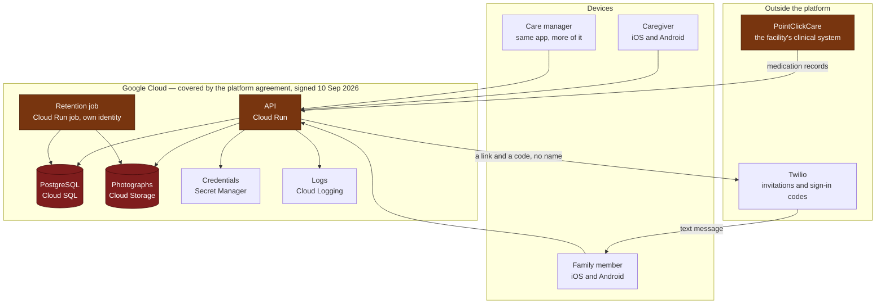
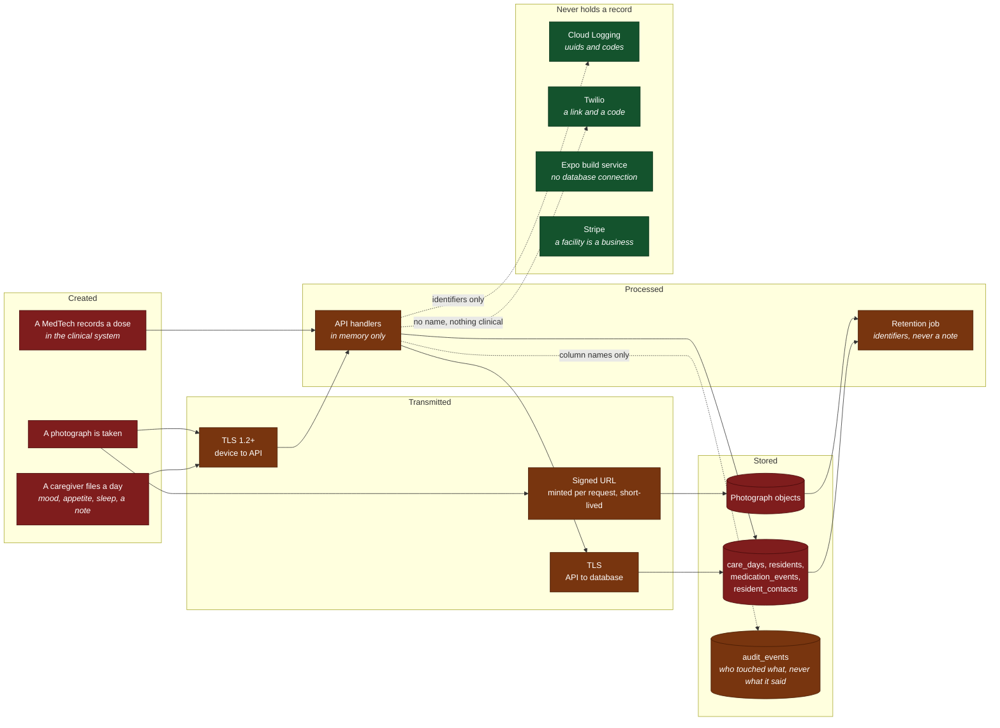
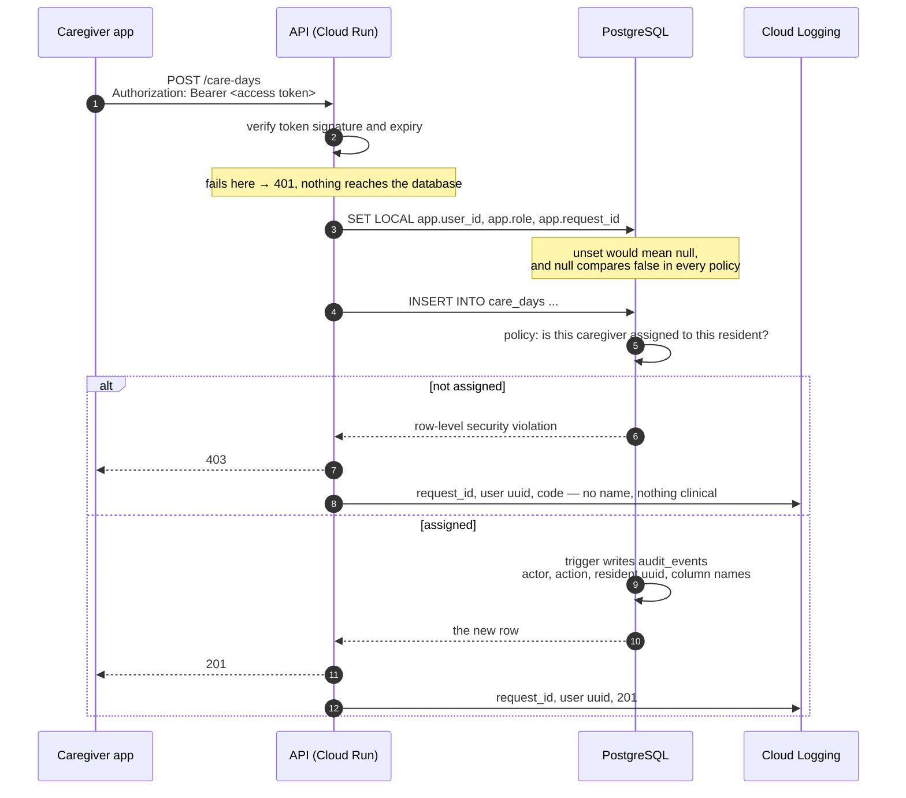
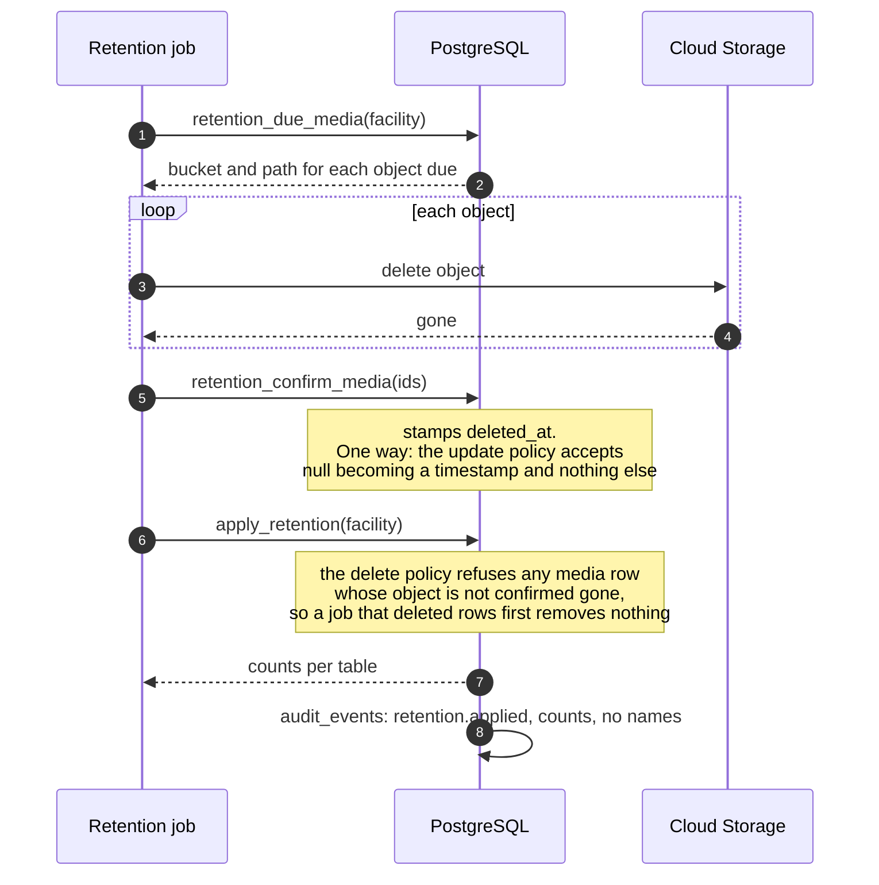

# Architecture and data flow

Four diagrams. The first says what the pieces are; the second says where a resident's
record exists and where it does not, which is the one a reviewer is actually asking for;
the third follows a single request so that the identity check and the audit row have a
place rather than a paragraph; the fourth is the only flow that leaves the database.

Everything below is the target architecture. Nothing is deployed yet — the platform
agreement is signed, the project is not created. What exists today is the model in this
directory and the mobile client from Milestone 1.

---

## 1. The pieces

---

## 2. Where the record is

The colour is the whole diagram. Red holds a resident's record. Amber handles it without
keeping it. Everything unshaded never sees one, and the arrows into it are what keep that
true.

`audit_events` is amber rather than red on purpose. It records which columns changed and
never what they changed to, and that is proven rather than asserted: a care note is written
containing a string that exists nowhere else, and every column of every audit row is then
searched for it.

---

## 3. One request

Where identity is established, where the policies apply, and where the audit row comes
from. The last is the point: it is a consequence of the write rather than something a
handler remembers to do.

Reads are the honest gap and are marked as such wherever they appear. PostgreSQL cannot
trigger on `SELECT`, so a read is recorded by the application calling `audit_read()` on the
single path that serves resident data. That is a convention the code keeps rather than a
guarantee the database enforces, and it is the one place a forgetful handler still produces
a gap.

---

## 4. The one flow that leaves the database

A photograph lives in two places, so deleting it is a handshake rather than a statement.
The database will not let the row go until storage has confirmed the object is gone, and a
resident whose photographs are still in the bucket keeps their whole record until the next
run.

---

## What the diagrams assume

**Every arrow into the platform is TLS.** Device to Cloud Run, Cloud Run to Cloud SQL,
Cloud Run to Cloud Storage. The database is reached over a private address and is not
published to the internet.

**A photograph is never served from a public URL.** The row in `media_objects` is what
gates a signed link, and the link is minted after the policy has admitted the caller, never
before — so possession of a URL is not permission, and a withdrawn grant cannot be replayed
by keeping an old one.

**The retention job is not the API.** Separate identity, separate database role, and the
application cannot invoke it. A compromised session cannot cause a deletion.

**Medication flows one way.** Records arrive from the clinical system through the
integration role and carry a reference back to the record they came from. Nothing written
through a request may claim to have come from a clinical system.

**Nothing crosses into InkTree.** Not in this architecture. The reasoning, and what it
would cost to change, is in `inktree-alignment.md`.
